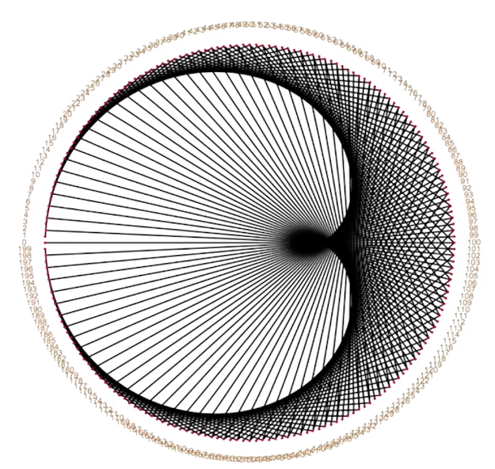

# [TimeTables-Play](https://harinathvutla.github.io/TimeTables-Play/)

"Generating beautiful patterns using timetables"

## Inspiration

This app is inspired from the youtube video [Mathologer](https://www.youtube.com/watch?v=qhbuKbxJsk8&t=185s) by maths professor "Burkard Polster" at Monash University in Melbourne, Australia.

## Concept of the App

Every one knows timetables and using the simple timetables it is possible to generate different beautiful patterns. 
To understand it, let us take a simple example as shown below

Let us generate 10 points on the circle which are equidistant from each other as shown below

And we label them as 0, 1, 2 and so on till 9, after 9 we have 10. But since we have only 10 points on the cirlce from 0 to 9 , the number 10 is a given 0, 11 to 1, 12 to 2 and so on.

So 0 stands for 0, 10, 20, ... and 1 for 1, 11, 21, ... and so on.

Now we consider the simplest timestable the 2x times table.

So we do the following

2 x 0 is 0, so we don't do anything. 
2 x 1 is 2, so we join points between label 1 with label 2 with a line. 
2 x 2 is 4, so we join points between label 2 with label 4 with a line. 
2 x 3 is 6, so we join points between label 3 with label 6 with a line. 
2 x 4 is 8, so we join points between label 4 with label 8 with a line. 
2 x 5 is 10, so we join points between label 5 with label 0 with a line. Since 10 is same as 0. 
2 x 6 is 12, so we join points between label 6 with label 2 with a line. Since 12 is same as 2. 
2 x 7 is 14, so we join points between label 7 with label 4 with a line. Since 14 is same as 4. 
2 x 8 is 16, so we join points between label 8 with label 6 with a line. Since 16 is same as 6. 
2 x 9 is 18, so we join points between label 9 with label 8 with a line. Since 18 is same as 8. 

And then 2 x 10 is 20 , And we know that 10 is same as 0 and 20 is same as 0 , so we cannot joint 0 and 0 since both represent same point.

When we do 2 x 11 is 22 , And we know 11 is same as 1 and 22 is same as 2 , And the line is already drawn.

So from here the pattern is repeated, so that means the lines are repeated and we no need to draw the lines again.

Now let's increase the number of points to 52, we see a pattern which is formed as shown below

Similarly, for 10 points and the 3 times table we have the following pattern

if we increase the points to 51 we have the following pattern

Similarly, for 200 points and the 2 times table we have the following pattern

So we can generate different patterns by playing with different points and multipler values.

## Technology

The app is built using JavaScript, P5.js, HTML5, CSS3

## Website

Website Link: [TimeTables Play](https://harinathvutla.github.io/TimeTables-Play/)

## Special thanks

Special thanks to the people who helped me during the development - the Ironhack teaching staff - [Montasar](https://github.com/mjarraya), [Svenja](https://github.com/Svemakawe), [Bruno](https://github.com/brudolce), [Min](https://github.com/angminsheng), and [Pierre](https://github.com/pierreportal)
